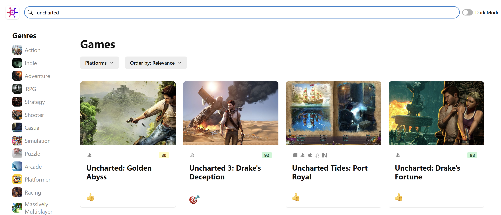
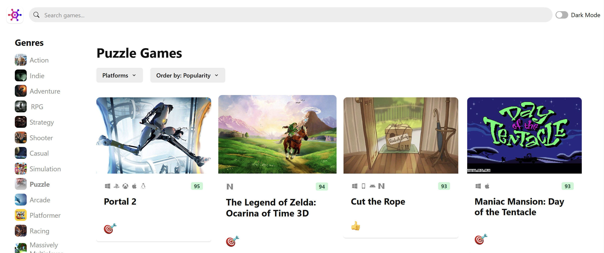
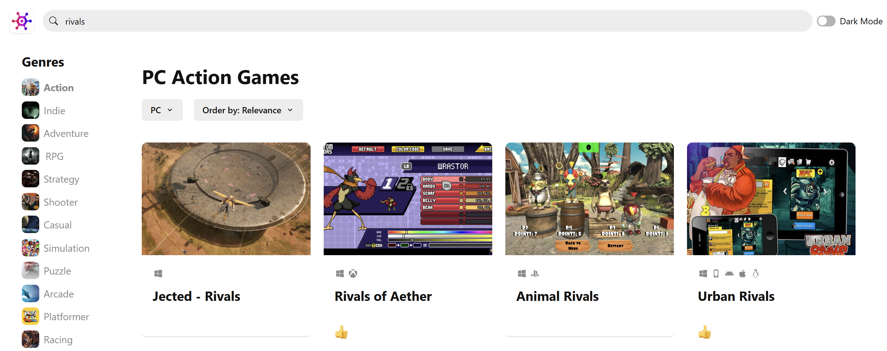

## GameHub 
GameHub is a user-friendly UI designed to explore thousands of games all in one place. Our platform allows you to search, sort, and filter games easily, making it effortless to find your next favorite game.

## Getting Started

to get started with GameHub, follow these steps:

1. Clone this repository to your local machine.
2. Run npm install to install the required dependencies.
3. Get a RAWG API key at https://rawg.io/apidocs. You'll have to create an account first.
4. Add the API key to src/services/api-client.ts
5. Run npm run dev to start the web server.

## Searching for Games 
### Use the search bar to find specific games by title.

## Sorting Games 
### Sort games by various criteria such as release date, popularity, and rating.

## Filtering Games 
### Apply filters to narrow down the selection based on genres, platforms, and more. 

